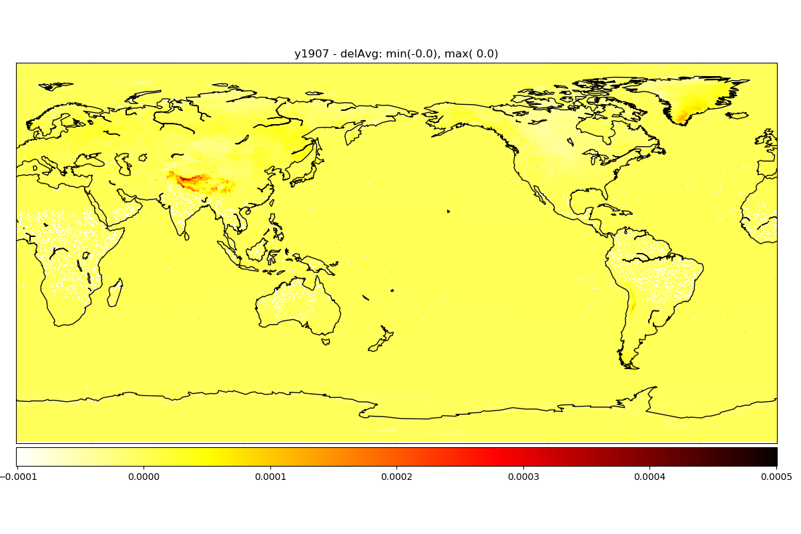
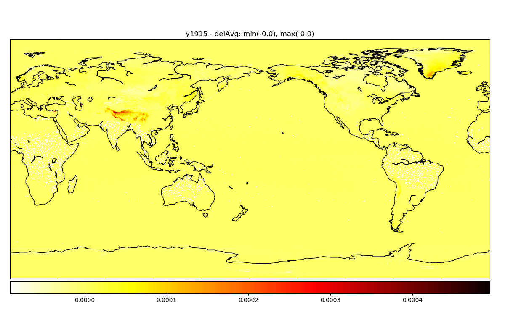
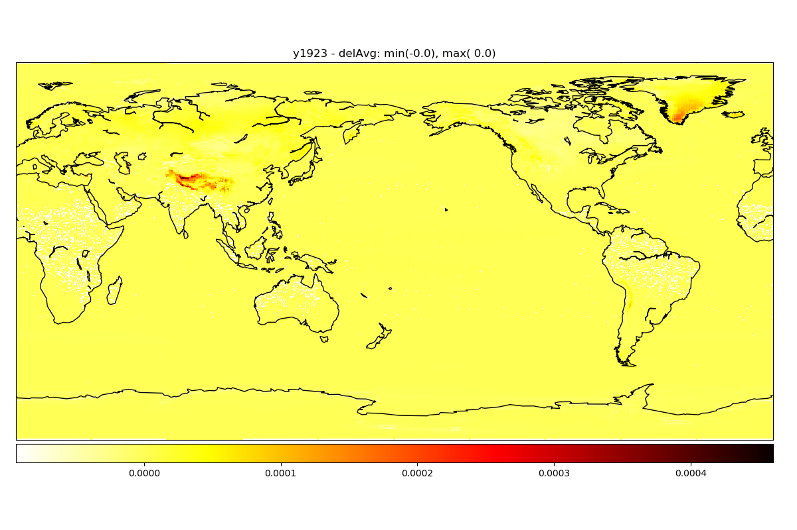
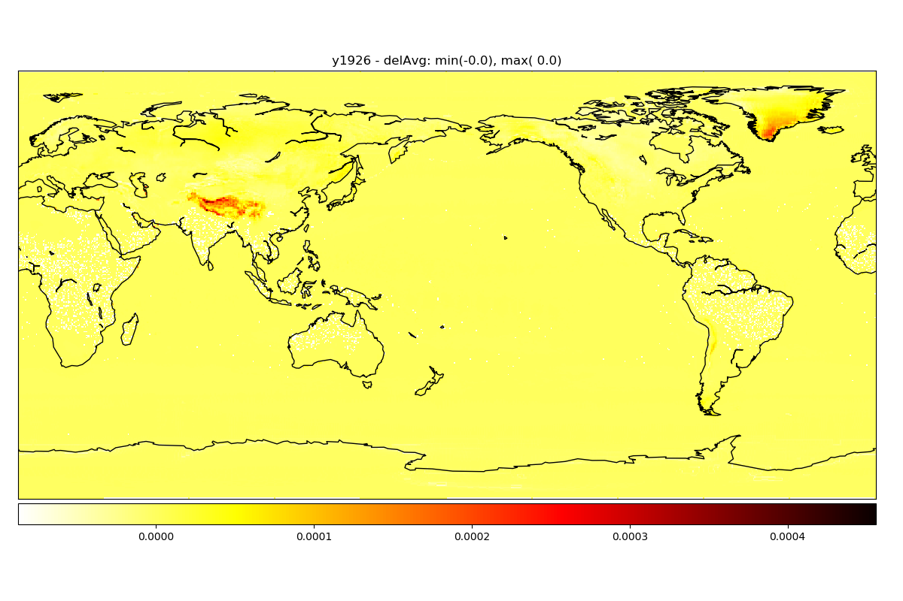
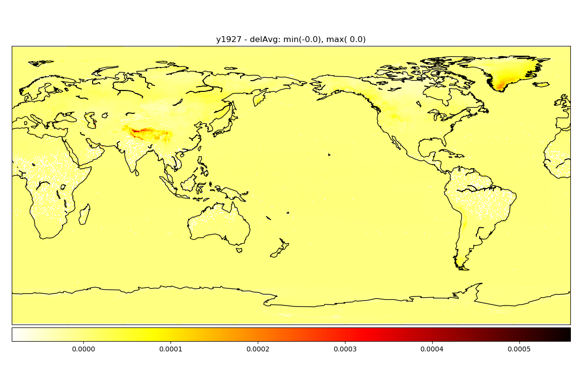
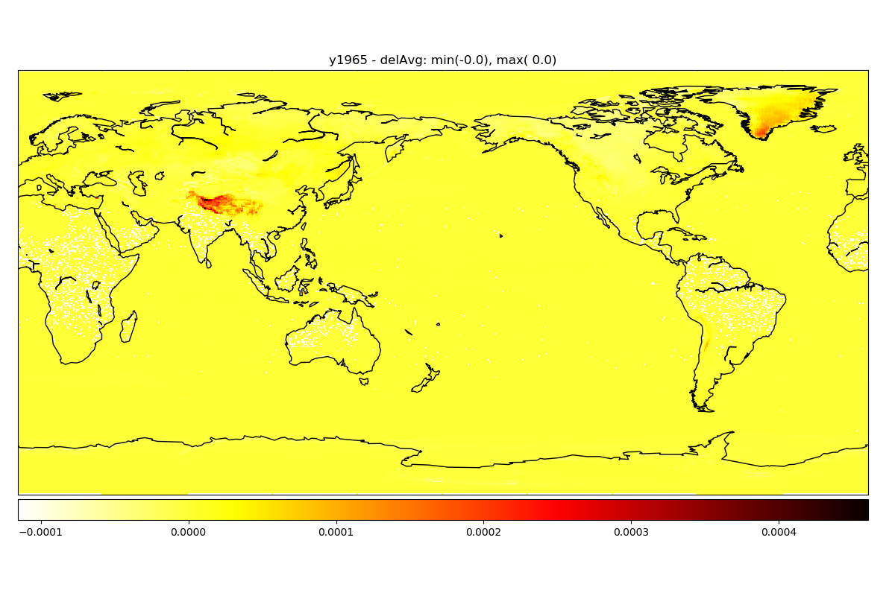

Reprocess 2m specific humidity (Qair)
=================================

Algorithm
---------
1. use despiked Tair

2. calculate Esat (sturation vapor pressure) below/above 0 degC separately according to Buck 1981
    - Buck, A. (1981) New Equations for Computing Vapor Pressure and Enhancement Factor, doi.org/10.1175/1520-0450(1981)020<1527:NEFCVP>2.0.CO;2

Annual summary
--------------

